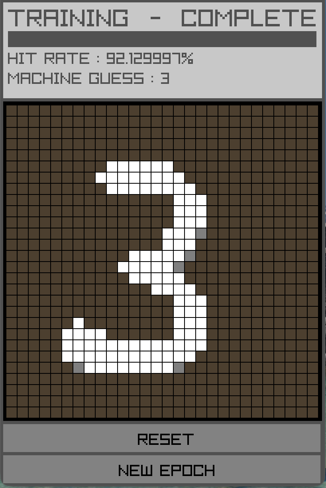

# homemade-neural-network
 
A learning project: a feed-forward neural network implemented from scratch in C++ (no ML libraries) and trained on the [MNIST](https://en.wikipedia.org/wiki/MNIST_database) handwritten digit dataset. A small [raylib](https://www.raylib.com/) UI lets you draw your own digits and watch the network guess them live.
 

 
## Features
 
- Fully hand-written neural network: matrix math, activation functions, forward pass, backpropagation and SGD
- Reads the original MNIST `.gz` files directly with zlib, including validation of the file headers
- Training runs on a background thread, so the UI stays responsive and shows training progress
- Draw a digit on a 28x28 grid and get the network's guess in real time
- Shows the hit rate on the 10 000-image test set after each training run
- Press **NEW EPOCH** to train for another epoch and watch the hit rate improve
- Cross-platform Makefile (macOS, Linux, Windows via MSYS2)
## How it works
 
The network has one hidden layer (784 → 128 → 10):
 
```
a1 = sigmoid(W0 · x  + b0)        hidden layer (128 neurons)
a2 = softmax(W1 · a1 + b1)        output layer (10 neurons, one per digit)
```
 
Each image is flattened to 784 values scaled to `[0, 1]`. The prediction is the output neuron with the highest probability.
 
**Training** uses plain stochastic gradient descent (one image per update). With softmax outputs and a cross-entropy loss, the error terms are:
 
```
e2 = a2 - y                              output error (y is the one-hot label)
e1 = (W1ᵀ · e2) ⊙ sigmoid'(z1)           hidden error
 
∂C/∂W = e · (previous layer)ᵀ            ∂C/∂b = e
W ← W - learning_rate · ∂C/∂W
```
 
Weights are initialised uniformly in `[-1, 1]` and scaled by `sqrt(1 / fan_in)`. The matrix multiplication inner loop is vectorised with OpenMP SIMD, and the program prints a time breakdown (forward pass, backpropagation, matrix multiplication) after every epoch.
 
The idea for the network came from 3Blue1Brown's deep learning video series.
 
## Requirements
 
You need a C++17 compiler with OpenMP, zlib, raylib, `pkg-config` and `make`.
 
**macOS** (Homebrew)
 
```bash
brew install libomp raylib pkg-config
```
 
**Debian / Ubuntu**
 
```bash
sudo apt install g++ make pkg-config zlib1g-dev libraylib-dev
```
 
If your distribution has no `libraylib-dev` package, [build raylib from source](https://github.com/raysan5/raylib).
 
**Windows**
 
Use an MSYS2 MinGW64 shell:
 
```bash
pacman -S make mingw-w64-x86_64-gcc mingw-w64-x86_64-raylib \
          mingw-w64-x86_64-zlib mingw-w64-x86_64-pkgconf
```
 
## Build and run
 
```bash
# 1. Download the dataset (needs curl or wget)
./download_MNIST.sh MNIST/MNIST/raw
 
# 2. Build
make
 
# 3. Run (from the project root, so the dataset paths resolve)
make run
```
 
The binary ends up in `build/nn_cpp` (`build/nn_cpp.exe` on Windows).
 
Other useful targets:
 
| Command | What it does |
|---|---|
| `make DEBUG=1` | Debug build: no optimisation, debug symbols, `assert` checks enabled |
| `make clean` | Removes the `build/` folder (run it when switching between normal and debug builds) |
| `make info` | Prints the detected platform and compiler flags |
 
If `./download_MNIST.sh` gives "permission denied", run `chmod +x download_MNIST.sh` first, or use `bash download_MNIST.sh MNIST/MNIST/raw`.
 
## Using the app
 
1. When the app starts, the network begins training automatically. The bar at the top shows progress, and **COMPLETE** appears when training and testing are done.
2. Draw a digit in the black area with the mouse. The **MACHINE GUESS** updates as you draw.
3. **RESET** clears the canvas.
4. **NEW EPOCH** runs another training pass over the full training set (only available once the current training run has finished).
Drawing works best with a single, centred digit, just like the MNIST images.
 

